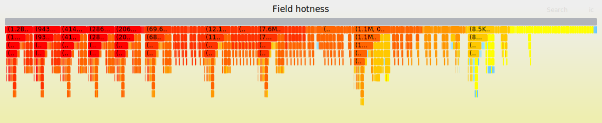

# Heap allocation type resolution using Debug information

This tool is an offline analysis tool for memory profiling aimed to support profile-guided memory optimizations. The tool is designed to interoperate directly with LLVM memprof profiles. The key idea is to resolve the precise memory layout from an allocation callstack using DWARF debug information. This allows us to understand memory access patterns at the type level. The easiest way to interact with this tool visually is to produce flamegraphs of field access counts.


## SPEC Leela field access count flamegraph



## Setup

A setup script is provided. Simply run `bash init.sh`. This repo relies on [bazel 6.4.0 is installed](https://bazel.build/install).  This script initializes all the submodules, builds an llvm with memprof and heapalloc enabled. The script also builds all the inputs for type resolver tests. This step may take a few hours. 

Once the `init.sh` script is complete, source the `env.sh` file with

```
source env.sh
```

Running any benchmarks expects everything to be run after the source.

### SPEC Setup

Set the **`$SPEC_DIR` environment variable** in `env.sh` if the tool should run on SPEC benchmarks. To run SPEC workloads with **memprof**, a working `cfg` file for collecting memory profiles for SPEC benchmarks is provided: [memprof.cfg](scripts/memprof.cfg). The benchmarks that support memprof are: `541.leela_r`, `523.xalancbmk_r`, `508.namd_r`, `510.parest_r`.

### LLVM Setup

To add the additional heap `alloc` dwarf info for direct heap allocations (i.e., allocations made with the `new` keyword), **LLVM** needs to be built with the heap `alloc` patch: [`heapalloc.patch`](./patches/heapalloc.patch).

## Run

The main command to run this artifact is in [`run.sh`](run.sh). The `--help` command gives insight into which benchmarks to run:

```
Usage: run.sh [OPTIONS]
Options:
  --all         Run all workload categories (spec, clang, fleetbench, folly).
  --spec        Run SPEC workloads.
  --clang       Run CLANG workloads.
  --fleetbench  Run Fleetbench workloads.
  --folly       Run Folly workloads.
  --benchmarks <benchmark1,benchmark2,...>
                Run only the specified benchmarks (comma-separated). Only runs if --<category> is specified also.
                Available benchmarks:
                  SPEC: 541.leela_r 523.xalancbmk_r 508.namd_r 510.parest_r
                  CLANG: llvm-dwarfdump llvm-objdump clang
                  Fleetbench: proto_benchmark swissmap_benchmark empirical_driver compression_benchmark hashing_benchmark cord_benchmark rpc_benchmark
```


## Contributing

See [`CONTRIBUTING.md`](docs/CONTRIBUTING.md) and [CODE_OF_CONDUCT](docs/CODE_OF_CONDUCT.md) for details.

## License

Apache 2.0; see [`LICENSE`](LICENSE) for details.

## Disclaimer

This project is not an official Google project. It is not supported by
Google and Google specifically disclaims all warranties as to its quality,
merchantability, or fitness for a particular purpose.

This is not an officially supported Google product. This project is not
eligible for the [Google Open Source Software Vulnerability Rewards
Program](https://bughunters.google.com/open-source-security).